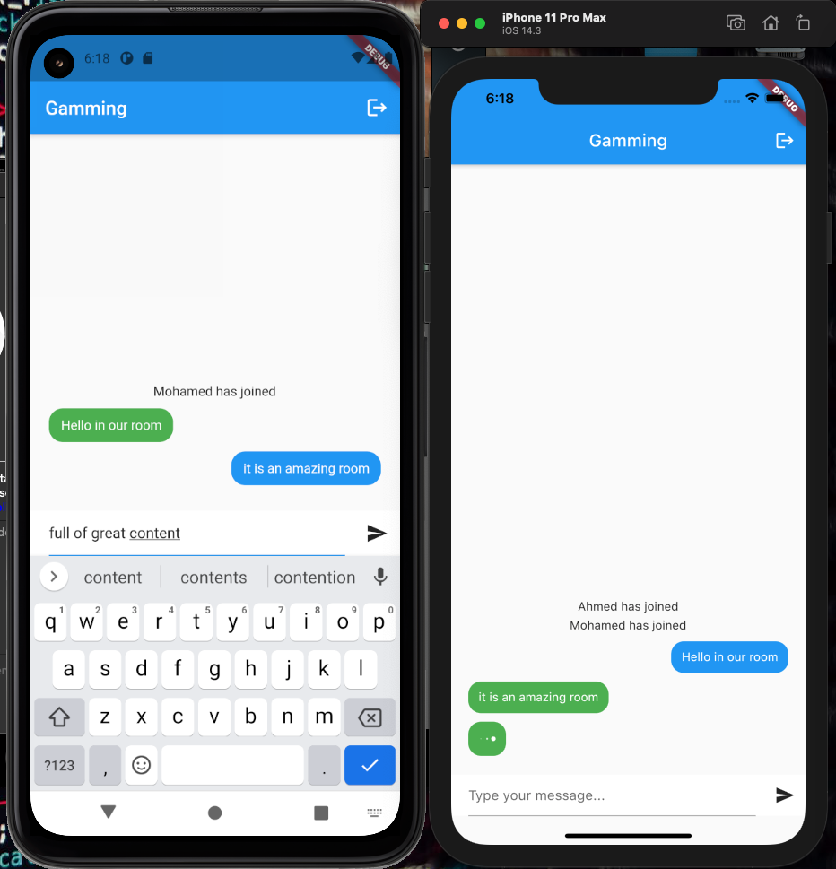

# Flutter Socket.IO Chat
This app is just a demo app to teach the idea and the tools to use to create a simple Socket.IO chat.

 Big thanks to [joyceHong0524](https://github.com/joyceHong0524)'s amazing Android native [project](https://github.com/joyceHong0524/socket.io_android).

## Features

- Join room.
- Send messages to a particular room you joined.
- Showing typing indication to the users in the same room.

## Runing the server (Node.js)

- Clone the project, run: `git clone https://github.com/AhmedAbouelkher/flutter_socket_io_chat.git`
- Download and Install [Node.js](https://nodejs.org/en/download/).
- Go into the flutter project folder, run: `cd path/to/project`
- Go into "server" folder, run: `cd server/` ( *or just run: `cd path/to/project/server/`* )
- Run: `npm install`
- Run: `node .` ( *or just run: `npm app.js`* )

Enjoy
